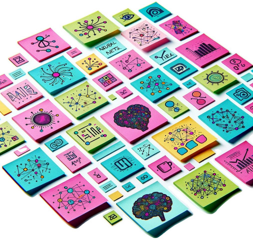

<h1>
Unleash AI potential for your business
</h1>

<strong>
Partner with a leading AI lab and transform your SME with customized AI solutions
</strong>

AI is revolutionizing how businesses operate: from automating tasks and improving efficiency, to supporting customers and answering enquiries. AI Pathfinder connects
Dutch SMEs with expertise to build practical AI solutions that address your specific challenges. We co-create AI-driven solutions tailored to your business, with practical value and sustainable integration.

What we offer:

<ul>
<li> Expert guidance from AI specialists working directly within your team</li>
<li> A flexible collaboration model starting with brainstorming sessions and growing to proofs-of-concept and prototypes, and beyond</li>
<li> Access to top AI tools, platforms and expertise through the Technical University of <a href="https://dai.win.tu.nl">Eindhoven (TU/e) Data and AI Lab</a></li>
</ul>

Why choose AI Pathfinder?

<ul>
<li> We link state-of-the-art techniques and business needs with tangible results</li>
<li> Our people-centric approach focuses AI solutions on real business problems</li>
<li> We strengthen your team's digital competencies for long-term success</li>
</ul>

Example projects from the lab:

<ul>
<li> Vision: <a href="https://dai.win.tue.nl/researchprojects/110/">smart automated monitoring of plants</a> for greenhouse optimization</li>
<li> Sensors: <a href="https://research.tue.nl/en/publications/signal-quality-analysis-for-long-term-ecg-monitoring-using-a-heal">performance analysis</a> of electrocardiogram monitoring patch signal quality</li>
<li> Modelling: <a href="https://www.tue.nl/en/research/research-groups/building-physics-and-services/building-performance/renovatieverkenner">a tool</a> to estimate the energy savings of potential home renovations</li>
</ul>

<strong>Interested?</strong> Let’s discover how a collaboration with a leading AI lab can transform your business. Contact us to explore the possibilities: <a href="m.r.danish@tue.nl">m.r.danish@tue.nl</a> 

