***


::: {#published-year .cell execution_count=2}
### 2024{#published-2024}

```{=html}
<ul class='list-group list-group-flush'><li class='list-group-item'><div class='grid'><div class='g-col-12 g-col-md-4'>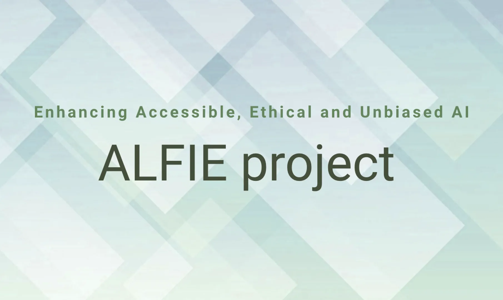</div><div class='g-col-12 g-col-md-8'><b>Assessment of Learning technologies and Frameworks for Intelligent and Ethical AI</b><br>EU Horizon Europe (2024-2027)<br><em>ALFIE aims to build an AutoML platform that streamlines AI evaluation, ensuring performance aligns with ethical standards and societal values.</em><br><a class="btn btn-outline-dark btn-sm", href="https://alfie-project.eu/" target="_blank" rel="noopener noreferrer">
        <i class="bi bi-journal-text" role='img' aria-label='Project website'></i>
        Project website
    </a></div></div></li>
<li class='list-group-item'><div class='grid'><div class='g-col-12 g-col-md-4'></div><div class='g-col-12 g-col-md-8'><b>SYNERGIES</b><br>EU Horizon Europe (2024-2027)<br><em>SYNERGIES will enhance the development, training, virtual testing, and validation of cooperative, connected and automated mobility systems.</em><br><a class="btn btn-outline-dark btn-sm", href="https://synergies-ccam.eu/" target="_blank" rel="noopener noreferrer">
        <i class="bi bi-journal-text" role='img' aria-label='Project website'></i>
        Project website
    </a></div></div></li>
<li class='list-group-item'><div class='grid'><div class='g-col-12 g-col-md-4'>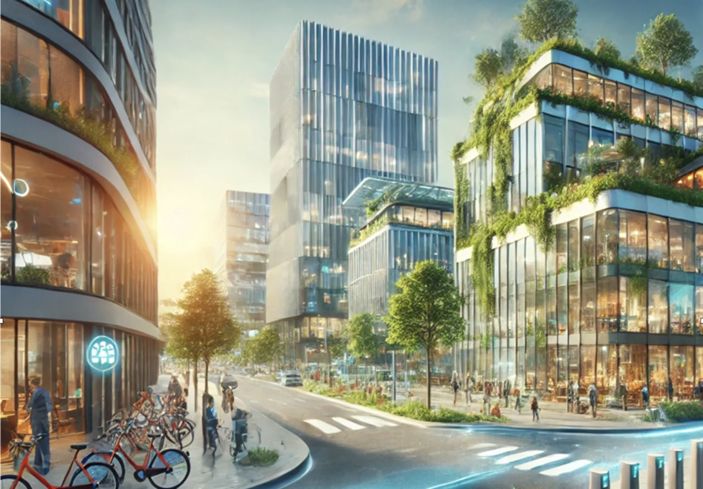</div><div class='g-col-12 g-col-md-8'><b>EDIH-SNL</b><br>EU Digital Europe (2024-2025)<br><em>The European Digital Innovation Hub South Netherlands aims to accellerate the digital transformation of manufacturing and maintenance SMEs.</em><br><a class="btn btn-outline-dark btn-sm", href="https://www.klikopmorgen.nl/" target="_blank" rel="noopener noreferrer">
        <i class="bi bi-journal-text" role='img' aria-label='Project website'></i>
        Project website
    </a></div></div></li>
<li class='list-group-item'><div class='grid'><div class='g-col-12 g-col-md-4'></div><div class='g-col-12 g-col-md-8'><b>Automated Machine Learning for all</b><br>Dutch Science Foundation, Open Science Fund (2024-2025)<br><em>This project leverages OpenML and AutoML to automatically build AI models and provide intuitive reports to help scientists make progress across many different fields.</em><br><a class="btn btn-outline-dark btn-sm", href="https://www.nwo.nl/projecten/osf232109" target="_blank" rel="noopener noreferrer">
        <i class="bi bi-journal-text" role='img' aria-label='Project website'></i>
        Project website
    </a></div></div></li></ul>
```

### 2022{#published-2022}

```{=html}
<ul class='list-group list-group-flush'><li class='list-group-item'><div class='grid'><div class='g-col-12 g-col-md-4'>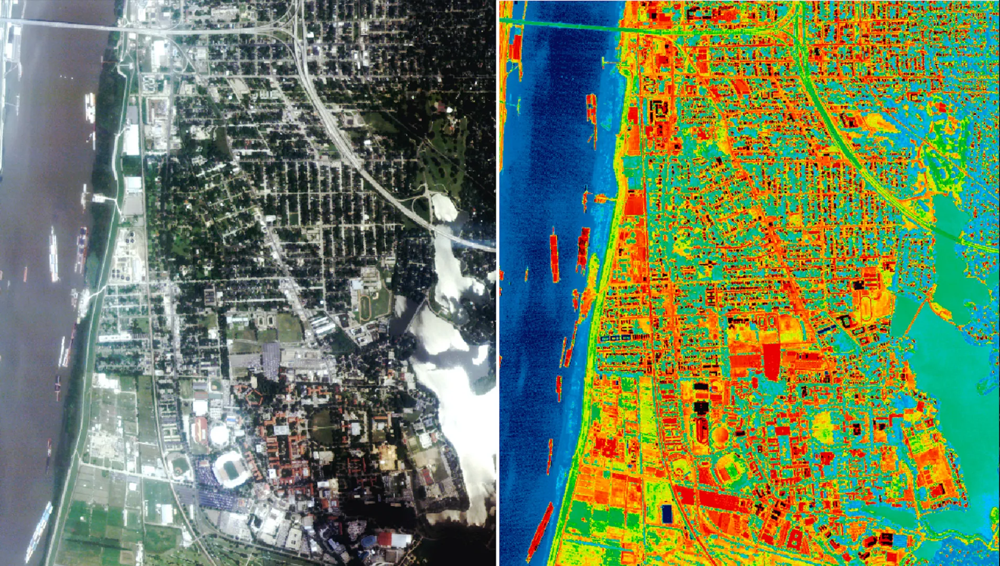</div><div class='g-col-12 g-col-md-8'><b>Machine Learning for building renovations</b><br>Dutch Government (2022-2026)<br><em>To make cities more sustainable, this project uses machine learning to predict the energy performance of buildings and optimize renovation strategies.</em><br><a class="btn btn-outline-dark btn-sm", href="https://www.tue.nl/en/research/research-groups/building-physics-and-services/building-performance/renovatieverkenner" target="_blank" rel="noopener noreferrer">
        <i class="bi bi-journal-text" role='img' aria-label='Project website'></i>
        Project website
    </a></div></div></li>
<li class='list-group-item'><div class='grid'><div class='g-col-12 g-col-md-4'>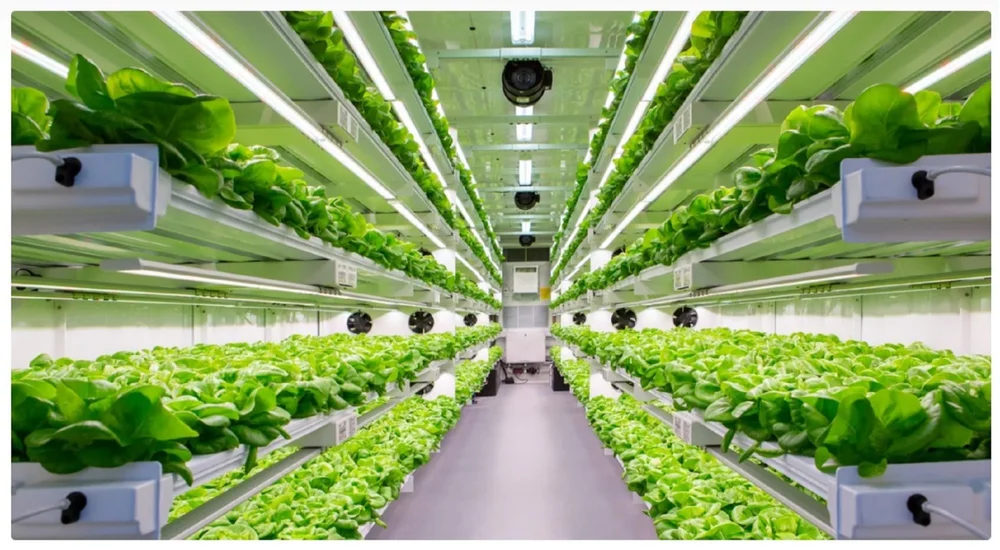</div><div class='g-col-12 g-col-md-8'><b>Digital Twin of a Vertical Farm</b><br>Dutch Science Foundation, Merian Fund (2022-2026)<br><em>Vertical farming allows us to grow more food using less resources. We use AI to model plants in 3D to understand how different light, CO2 and temperature scenarios impact plant growth and photosynthesis.</em><br><a class="btn btn-outline-dark btn-sm", href="https://dai.win.tue.nl/researchprojects/110/" target="_blank" rel="noopener noreferrer">
        <i class="bi bi-journal-text" role='img' aria-label='Project website'></i>
        Project website
    </a></div></div></li>
<li class='list-group-item'><div class='grid'><div class='g-col-12 g-col-md-4'>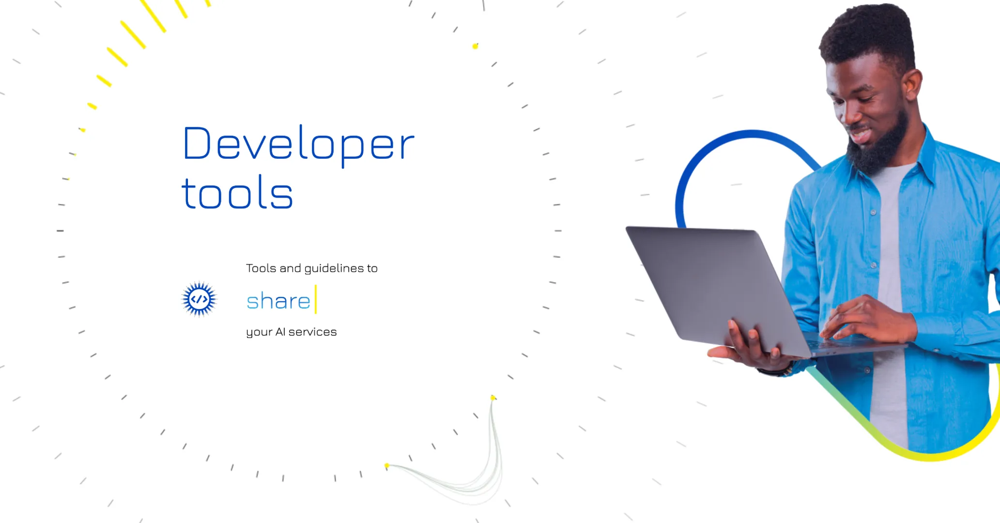</div><div class='g-col-12 g-col-md-8'><b>AI4Europe</b><br>EU Horizon Europe (2022-2025)<br><em>The AI-on-Demand platform (AIoD) is a community-driven platform designed to empower European research and innovation in Artificial Intelligence (AI).</em><br><a class="btn btn-outline-dark btn-sm", href="https://aiod.eu/" target="_blank" rel="noopener noreferrer">
        <i class="bi bi-journal-text" role='img' aria-label='Project website'></i>
        Project website
    </a></div></div></li></ul>
```

### 2020{#published-2020}

```{=html}
<ul class='list-group list-group-flush'><li class='list-group-item'><div class='grid'><div class='g-col-12 g-col-md-4'>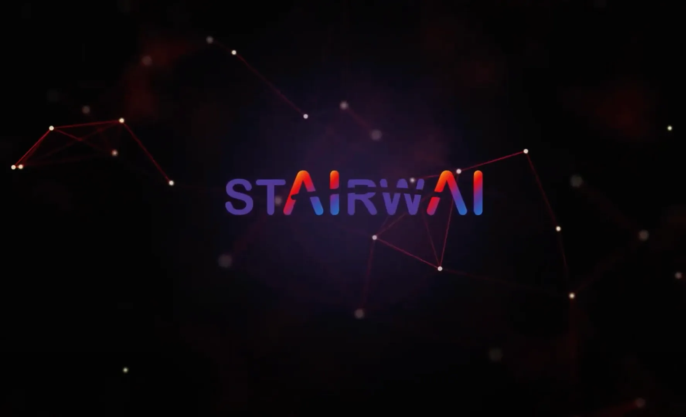</div><div class='g-col-12 g-col-md-8'><b>Stairway to AI</b><br>EU Horizon 2020 (2020-2024)<br><em>The StairwAI project aims to provide a matchmaking service for users of the AI-on-Demand platform to easily find AI assets, experts, knowledge, hardware resource providers and much more.</em><br><a class="btn btn-outline-dark btn-sm", href="https://stairwai.nws.cs.unibo.it/" target="_blank" rel="noopener noreferrer">
        <i class="bi bi-journal-text" role='img' aria-label='Project website'></i>
        Project website
    </a></div></div></li>
<li class='list-group-item'><div class='grid'><div class='g-col-12 g-col-md-4'></div><div class='g-col-12 g-col-md-8'><b>Continuous monitoring in personal and physical health</b><br>ITEA Inno4Health (2020-2024)<br><em>Inno4Health stimulates continuous monitoring in personal and physical health, improving patient care and athlete performance.</em><br><a class="btn btn-outline-dark btn-sm", href="https://inno4health.eu/" target="_blank" rel="noopener noreferrer">
        <i class="bi bi-journal-text" role='img' aria-label='Project website'></i>
        Project website
    </a></div></div></li>
<li class='list-group-item'><div class='grid'><div class='g-col-12 g-col-md-4'>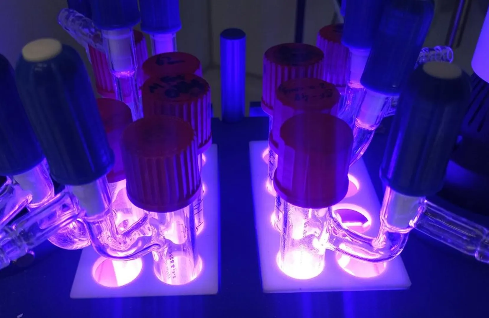</div><div class='g-col-12 g-col-md-8'><b>Multi Modal Photochemistry</b><br>Dutch Science Foundation, TTW (2020-2024)<br><em>In this project, we aimed to optimize the photochemical synthesis of complex molecules using machine learning.</em><br></div></div></li>
<li class='list-group-item'><div class='grid'><div class='g-col-12 g-col-md-4'>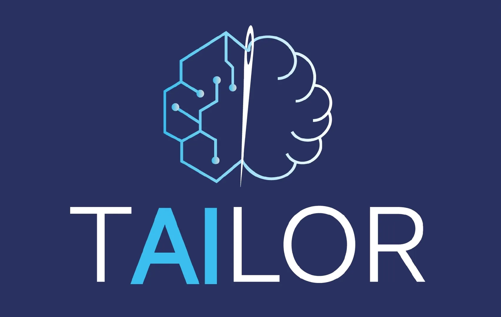</div><div class='g-col-12 g-col-md-8'><b>TAILOR Network of AI Excellence</b><br>EU Horizon 2020 (2020-2024)<br><em>TAILOR is one of the first European networks of research excellence in AI, focussing on Trustworthy AI.</em><br><a class="btn btn-outline-dark btn-sm", href="https://tailor-network.eu/" target="_blank" rel="noopener noreferrer">
        <i class="bi bi-journal-text" role='img' aria-label='Project website'></i>
        Project website
    </a></div></div></li>
<li class='list-group-item'><div class='grid'><div class='g-col-12 g-col-md-4'>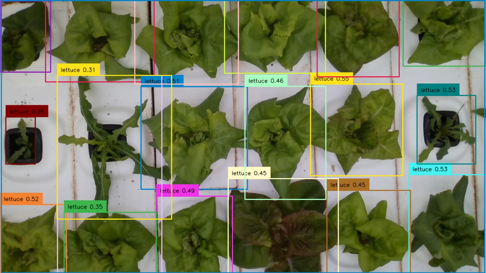</div><div class='g-col-12 g-col-md-8'><b>SkyHigh: Leveraging AI in Vertical Farming</b><br>Dutch Science Foundation (2020-2024)<br><em>Vertical farming allows us to grow more food using less resources. We use AI to track plant growth non-invasively and optimize growth.</em><br><a class="btn btn-outline-dark btn-sm", href="https://www.sky-high.info/" target="_blank" rel="noopener noreferrer">
        <i class="bi bi-journal-text" role='img' aria-label='Project website'></i>
        Project website
    </a></div></div></li></ul>
```

### 2019{#published-2019}

```{=html}
<ul class='list-group list-group-flush'><li class='list-group-item'><div class='grid'><div class='g-col-12 g-col-md-4'>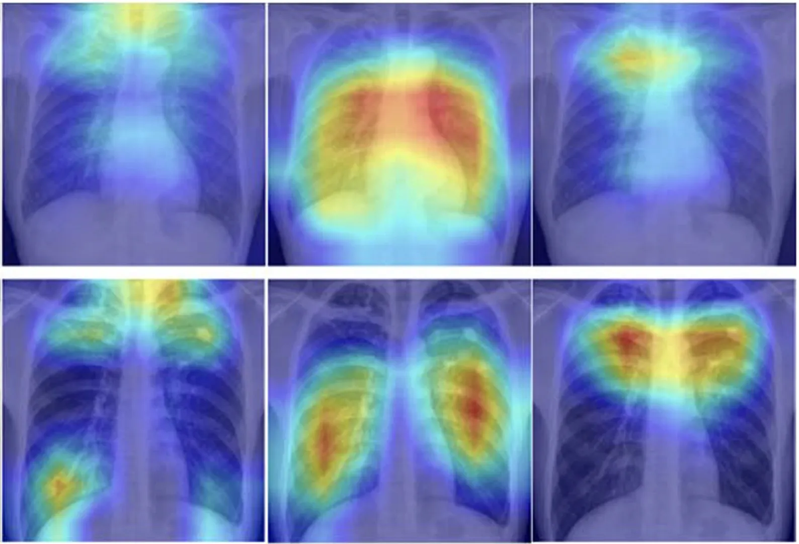</div><div class='g-col-12 g-col-md-8'><b>Educational platform for machine learning and medical image analysis</b><br>TU Eindhoven, BOOST (2019-2025)<br><em>AI education should be scalable and engaging. This project aims to leverage OpenML for AI-related university courses, challenging students to build the best AI models in an engaging environment.</em><br><a class="btn btn-outline-dark btn-sm", href="https://boost.tue.nl/" target="_blank" rel="noopener noreferrer">
        <i class="bi bi-journal-text" role='img' aria-label='Project website'></i>
        Project website
    </a></div></div></li>
<li class='list-group-item'><div class='grid'><div class='g-col-12 g-col-md-4'>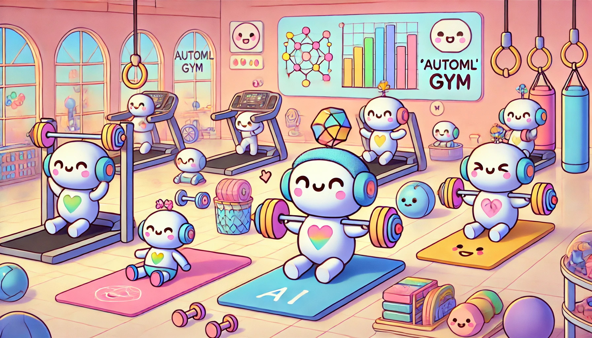</div><div class='g-col-12 g-col-md-8'><b>The AutoML Gym</b><br>Amazon Research Award (2019-2020)<br><em>This project aimed to evolve AutoML systems (agents) in an environment of increasingly difficult tasks, in which AutoML agents can be uploaded as docker images and run on AWS infrastructure.</em><br><a class="btn btn-outline-dark btn-sm", href="https://www.amazon.science/research-awards/recipients/joaquin-vanschoren" target="_blank" rel="noopener noreferrer">
        <i class="bi bi-journal-text" role='img' aria-label='Project website'></i>
        Project website
    </a></div></div></li></ul>
```

### 2017{#published-2017}

```{=html}
<ul class='list-group list-group-flush'><li class='list-group-item'><div class='grid'><div class='g-col-12 g-col-md-4'>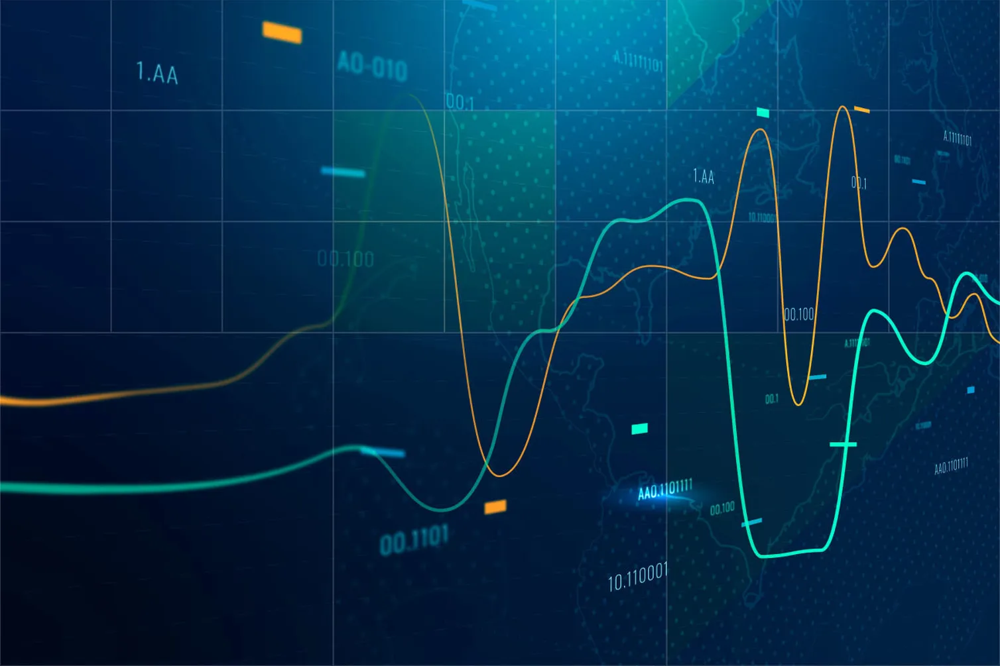</div><div class='g-col-12 g-col-md-8'><b>Dynamic Data Analytics through Automatically Constructed Machine Learning Pipelines</b><br>Dutch Science Foundation, Commit2Data (2017-2021)<br><em>This project created new online automated machine learning pipelines, new methods for multi-variate time series prediction, and new approaches for early stage Parkinson's disease diagnostics from videos.</em><br><a class="btn btn-outline-dark btn-sm", href="https://www.nwo.nl/en/projects/628011002" target="_blank" rel="noopener noreferrer">
        <i class="bi bi-journal-text" role='img' aria-label='Project website'></i>
        Project website
    </a></div></div></li>
<li class='list-group-item'><div class='grid'><div class='g-col-12 g-col-md-4'>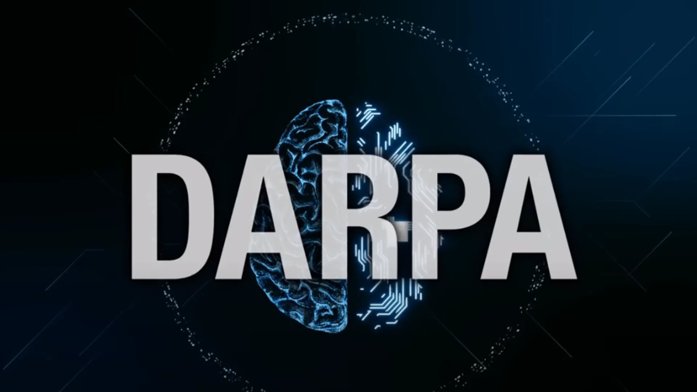</div><div class='g-col-12 g-col-md-8'><b>Data Driven Discovery of Models</b><br>DARPA (2017-2021)<br><em>The first DARPA challenge on AutoML, the Data-Driven Discovery of Models (D3M) program developed automated methods to create empirical models of real, complex processes. It also lead to the creation of the AutoML benchmark.</em><br><a class="btn btn-outline-dark btn-sm", href="https://datadrivendiscovery.org/" target="_blank" rel="noopener noreferrer">
        <i class="bi bi-journal-text" role='img' aria-label='Project website'></i>
        Project website
    </a></div></div></li></ul>
```

### 2016{#published-2016}

```{=html}
<ul class='list-group list-group-flush'><li class='list-group-item'><div class='grid'><div class='g-col-12 g-col-md-4'></div><div class='g-col-12 g-col-md-8'><b>A Cloud-Based Platform for AutoML</b><br>Microsoft Azure Research Award (2016-2016)<br><em>With sponsorship from Microsoft, we ran the first large-scale machine learning benchmarks on Azure, which are still accessible on OpenML today.</em><br><a class="btn btn-outline-dark btn-sm", href="https://research.tue.nl/nl/prizes/microsoft-azure-research-award" target="_blank" rel="noopener noreferrer">
        <i class="bi bi-journal-text" role='img' aria-label='Project website'></i>
        Project website
    </a></div></div></li></ul>
```

### 2012{#published-2012}

```{=html}
<ul class='list-group list-group-flush'><li class='list-group-item'><div class='grid'><div class='g-col-12 g-col-md-4'>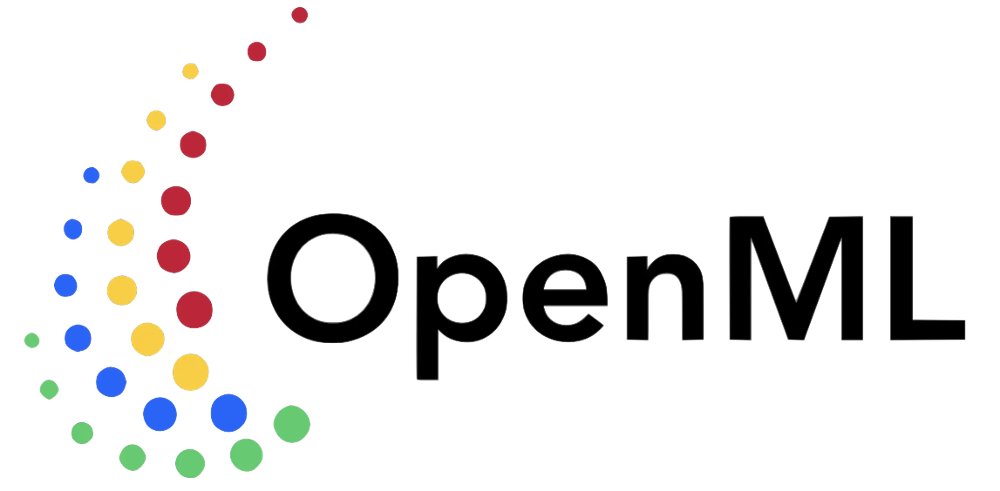</div><div class='g-col-12 g-col-md-8'><b>Massively Collaborative Machine Learning</b><br>Dutch Science Foundation, Free Competition (2012-2016)<br><em>This project created OpenML, an open science platform for sharing data, code, and experiments in machine learning.</em><br><a class="btn btn-outline-dark btn-sm", href="https://www.nwo.nl/en/projects/612001206-0" target="_blank" rel="noopener noreferrer">
        <i class="bi bi-journal-text" role='img' aria-label='Project website'></i>
        Project website
    </a></div></div></li>
<li class='list-group-item'><div class='grid'><div class='g-col-12 g-col-md-4'></div><div class='g-col-12 g-col-md-8'><b>MLOpen Machine Learning Platform</b><br>EU PASCAL Harvest (2012-2013)<br><em>This exploratory project brought together scientists and engineers to create an open machine learning platform, forming the foundation of the OpenML community.</em><br></div></div></li></ul>
```

:::


